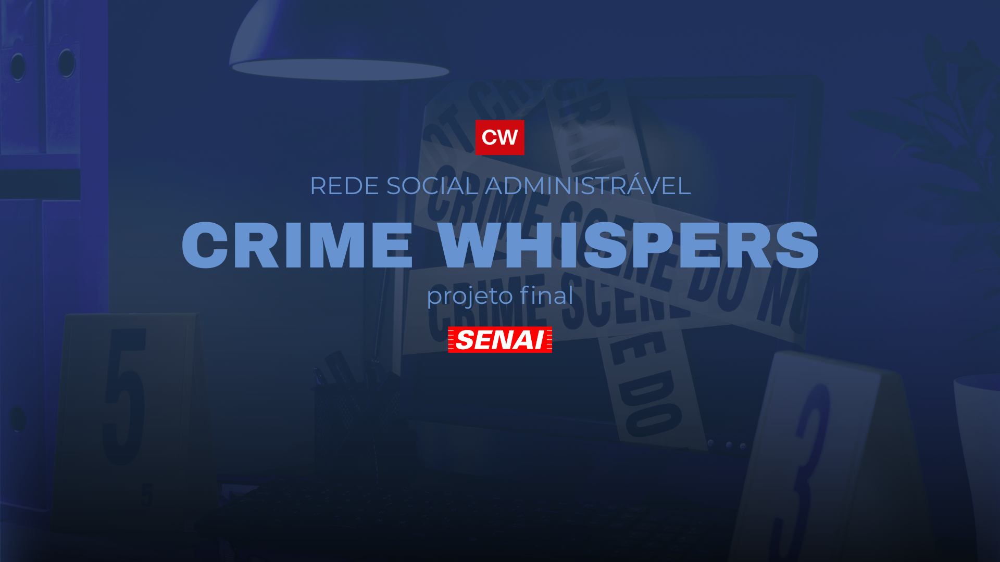

  

## CRIME WHISPERS - Rede Social Administrável
O objetivo é oferecer uma plataforma interativa e segura para comunicação digital, com foco em inovação, segurança e eficiência nas interações digitais.

## Equipe

| Foto | Nome | Função | GitHub | E-mail |
|------|------|--------|--------|--------|
|  | **Anna Beatriz Leme Alves** | Dev | [@annabialeme](https://github.com/annabialeme) | anna.b.alves7@aluno.senai.br |
|  | **Júlia Andrade Guarnieri** | Product Owner | [@juguarnieri](https://github.com/juguarnieri) | julia.guarnieri@aluno.senai.br |
|  | **Luiz Gabriel Lopes Carvalho** | Dev | [@LuizGabrielLopes](https://github.com/LuizGabrielLopes) | luiz.g.carvalho11@aluno.senai.br |
|  | **Carlos Eduardo Ferraz Augusto** | Dev | [@Caduaugusto10](https://github.com/Caduaugusto10) | carlos.e.augusto@aluno.senai.br |
|  | **Luiza Nicoluci Schettini** | Scrum Master | [@luschettini](https://github.com/luschettini) | luiza.schettini@aluno.senai.br |
